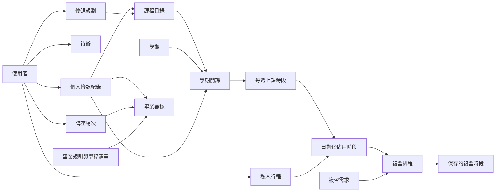

# Make_NUTN_Better 資料使用說明

> 第一版資料規劃草案。本文供前端、後端、資料庫、排程與 AI 開發者協作使用，不表示所有欄位或功能已實作。後端框架、資料庫技術與實際資料表設計尚未決定。

## 1. 第一版範圍

系統供課堂展示，包含課表、待辦與私人行程、複習安排、修課規劃、畢業進度。資料來源為預設測試資料與手動新增。

- 正式需要登入，但第一階段延後實作。後端可使用固定測試使用者，私人資料仍須關聯使用者 ID。
- 使用者負責後端、資料庫及 AI 使用的資料格式；AI 功能實作另行分工。
- 畢業規則以資工系 115 學年度入學為對象，依團隊決策使用 114 學程課程清單。
- 手動新增範圍包含課表、待辦／行程、歷年修課紀錄與講座完成場次。
- 第一版不處理抵免、免修、替代、重修流程、講座心得認證與其他校級畢業門檻。
- 推播、自動重新排程、最佳選課推薦、GPA 與畢業時間預估目前不納入本文件的資料契約。

原型位於 `codex/frontend-student-planner` 分支的 `frontend/`。目前使用示範資料與瀏覽器 localStorage，尚未串接正式後端。本文新增的使用者、學期、開課、規則版本等設計，屬於待實作規劃。

## 2. 如何理解資料

| 種類 | 定義 | 例子 |
| --- | --- | --- |
| 共用資料 | 多位使用者共同參考 | 課程目錄、學期、地圖 |
| 個人紀錄 | 屬於某位使用者的事實或安排 | 修課紀錄、待辦、行程、講座場次 |
| 規則與需求 | 判定或安排的條件 | 畢業門檻、先修條件、複習需求 |
| 計算結果 | 由資料與規則產生 | 剩餘學分、衝突、空閒時段、審核狀態 |
| 畫面狀態 | 操作介面的暫存選擇 | 選定日期、日／週模式、地圖倍率 |

原始紀錄是主要依據；統計與進度應從紀錄計算。複習時段雖由排程產生，但保存及手動修改後屬於個人安排，必須持續保存。

## 3. 共用格式約定（建議契約）

以下欄位名稱與型別是供團隊確認的技術中立建議，並非已存在的 API。

- ID 一律以字串交換，由後端產生；不要以課名或時間戳直接充當跨系統識別。
- 日期使用 `YYYY-MM-DD`；本地時間使用 `HH:mm`；單次事件完整時間使用含時差的 ISO 8601，例如 `2026-10-05T14:00:00+08:00`。
- 時區使用 `Asia/Taipei`。學年度使用民國年度整數，例如 115；不可與西元日期混用。
- 星期建議使用 1～7，1 為星期一、7 為星期日。現有前端為 JavaScript 0～6（0 是星期日），串接時必須轉換。
- 時長一律以整數分鐘交換；畫面可顯示小時。學分為非負數值，不假定永遠為整數。
- 私人資料必須關聯 `user_id`；正式登入後由後端取得身分，不應信任前端自行指定其他人的 ID。
- 可修改的持久資料建議保存 `created_at`、`updated_at`；可加 `source_type` 區分 `seed`、`manual`、`generated`。
- `null` 代表未知或未提供，不能當作 0、沒過或已達標。空陣列及 0 必須是明確提供的資料。
- `status` 在不同資料組有不同意義，不能混用修課狀態、審核狀態與請求成功狀態。
- 本文「必要」表示該功能的資料需求；建立表單時哪些欄位可由後端帶入，另由介面設計決定。

## 4. 共用與個人資料清單

以下是資料分組，不表示一組必須對應一張資料表。標記「建議」的細節仍可由團隊調整。

### 4.1 使用者 `users`

| 欄位 | 型別 | 必要性／用途 |
| --- | --- | --- |
| user_id | string | 必要，使用者識別 |
| display_name | string | 畫面顯示名稱 |
| department_id | string | 必要，所屬系所識別 |
| department_name | string | 顯示名稱，可由系所資料取得 |
| admission_year | integer | 必要，入學學年度 |
| rule_set_id | string | 必要，適用畢業規則版本 |
| current_semester_id | string | 課表功能必要 |
| timezone | string | 預設 Asia/Taipei |

登入供應方式尚未決定，不在此階段固定密碼或認證資料結構。

### 4.2 學期 `semesters`

| 欄位 | 型別 | 用途 |
| --- | --- | --- |
| semester_id | string | 學期識別 |
| academic_year | integer | 民國學年度 |
| term | string | 上學期／下學期；暑期是否支援另議 |
| starts_on、ends_on | date | 課表展開有效範圍 |

不要推測實際校曆日期，預設資料需明確填寫展示用期間。

### 4.3 課程目錄 `courses` 與規則分類

| 欄位 | 型別 | 用途 |
| --- | --- | --- |
| course_id | string | 穩定課程識別 |
| course_code | string/null | 正式課程代碼；未知時不虛構 |
| name | string | 課程名稱 |
| offering_department_id | string/null | 開課系所，用於本系／外系判定 |
| credits | number | 採計學分 |
| catalog_version | string | 建議，避免改動影響歷史資料 |
| rule_set_id | string | 分類所適用規則 |
| credit_category | string | 下方分類值之一 |
| general_core_key | string/null | 通識核心要求，如英文 |
| general_domain | string/null | 領域課程必要 |
| prerequisite_course_ids | string[]/null | 先修課程；空清單為已知無先修，null 為未知 |
| prerequisite_mode | string/null | 建議：all／any，須有來源才填 |
| program_ids | string[] | 可由學程課程清單推得，不必雙份維護 |

學分分類建議值：`general_core`（通識核心）、`general_domain`（通識領域）、`general_diverse`（通識多元）、`college_required`（院核心必修）、`department_required`（專業必修）、`department_elective`（本系專業選修）、`free_elective`（其他符合條件的自由選修）。

先判定指定通識與必修，再判定其餘選修的本系／外系。分類與適用規則有關，不宜永久當成課程對所有學生都相同的屬性。可以獨立保存「規則—課程分類」對照。

先修關係需要明確來源；課程地圖的所有連線不可直接當成強制先修。

### 4.4 開課 `course_offerings` 與上課時段 `class_meetings`

| 資料組 | 欄位 | 用途 |
| --- | --- | --- |
| 開課 | offering_id、course_id、semester_id | 某門課在某學期的開課 |
| 開課 | section_name | 班別或組別，選填 |
| 上課時段 | meeting_id、offering_id | 某次開課的每週時段 |
| 上課時段 | weekday、start_time、end_time | 星期與起訖時間 |
| 上課時段 | campus_id、location | 校區與地點；未知可留空 |

一門課可有多次開課，一次開課可有多筆每週時段。課表依學期範圍展開。假日停課與單次調課尚未定義，第一版不自動宣稱已處理。

### 4.5 個人修課紀錄 `enrollments`

| 欄位 | 型別 | 用途 |
| --- | --- | --- |
| enrollment_id、user_id、course_id | string | 紀錄、學生與課程關聯 |
| semester_id | string | 修課學期 |
| offering_id | string/null | 當期課表需要；歷史紀錄可無開課資料 |
| enrollment_status | string | 建議 in_progress／finished |
| passed | boolean/null | 已結束時必填；修習中為 null |
| grade | number/null | 選填，數字成績60分以上通過 |
| course_version 或課程快照 | version/object | 保存當次有效的名稱、學分與分類依據，實作擇一 |

規則：只有通過的課程計入已取得學分。修習中、規劃中不計入。若成績與 passed 矛盾，回報資料問題，相關審核待確認。第一版不處理重修流程；重複輸入需提示整理，不重複相加。

### 4.6 待辦 `tasks`

| 欄位 | 型別 | 用途 |
| --- | --- | --- |
| task_id、user_id | string | 識別與歸屬 |
| title | string | 待辦名稱 |
| type | string | 待辦／作業／報告／考試／複習 |
| course_id | string/null | 相關課程，選填 |
| due_date | date | 截止或事項日期 |
| due_time | time/null | 時間可未知，不自動捏造 |
| completed | boolean | 是否完成 |
| event_id | string/null | 建議，若同一考試另有佔用時段可關聯行程 |

截止時間不等於佔用時段。若考試要阻擋排程，需對應一筆有開始與結束時間的行程。只有日期的事項如何排序，需在 API／畫面採一致規則。

### 4.7 私人行程 `personal_events`

必要欄位：`event_id`、`user_id`、`title`、`starts_at`、`ends_at`；選填 `location`、`related_task_id`。

結束必須晚於開始。現有表單以單日行程為主；後端以完整日期時間表示，不代表畫面已支援跨日操作。編輯檢查需排除目前 event_id。

### 4.8 複習計畫 `study_plans`

| 欄位 | 型別 | 用途 |
| --- | --- | --- |
| plan_id、user_id、course_id | string | 計畫歸屬 |
| exam_task_id | string/null | 對應考試待辦，選填 |
| start_date | date | 開始安排日期 |
| exam_date | date | 考試日期；建議第一版沿用前端，排程至前一日 |
| exam_at | datetime/null | 未來精確到當日排程時使用，先不依未知時間安排 |
| target_minutes | integer | 需求總分鐘，大於0 |
| session_minutes | integer | 每次安排分鐘，大於0 |
| allowed_windows | array | 可安排日期或星期及開始／結束時間 |

目前前端預設上午08:00–12:00、下午13:00–18:00、晚上18:00–22:00；這些是原型設定，不是校方規定。模組介面應傳實際時間，不只傳上午／下午文字。

複習時段 `study_sessions`：`session_id`、`plan_id`、`user_id`、`title`、`starts_at`、`ends_at`、選填 `location`。

排程結果中的時段需保存，支援手動修改與刪除。`scheduled_minutes`、`remaining_minutes`、時段數由當前時段重新計算。建議重新產生時只取代指定 plan_id 的時段，保留其他計畫；替換策略需串接前確認。

### 4.9 修課規劃 `planned_courses`

必要欄位：`planned_course_id`、`user_id`、`target_semester_id`、`course_id`。若已選定班別，可再加選填 `offering_id`。

同一學生同一目標學期不重複加入同一課。加入規劃不代表已選上或已通過。沒有目標學期的開課時間時，不可宣稱已檢查撞課。

### 4.10 畢業規則與學程 `graduation_rules`、`programs`

詳細規則使用 [nutn_csie_115_graduation_rules_v1.json](./nutn_csie_115_graduation_rules_v1.json)。若只上傳本文，需另將該 JSON 放在同一目錄，或調整此連結。

規則需包含 `rule_set_id`、版本、系所、入學年度、資料來源、學分門檻、指定必修、領域要求、學程要求、講座要求及第一版排除項目。

學程需包含 `program_id`、名稱、清單年度、課程識別清單、最低通過門數。JSON目前以部分課名列示，串接前需映射穩定 course_id；未知代碼不可捏造。

### 4.11 講座場次 `lecture_progress`

必要欄位：`user_id`、`professional_count`、`general_count`、`updated_at`。場次為非負整數，尚未提供時使用 null 而非0。

第一版只保存兩類總數，不保存逐場活動或心得證明。兩類獨立計算，不互相抵用。同一場次不得重複計入，但只保存總數的系統無法核驗，需由輸入者確保正確。

### 4.12 地圖設定 `campus_maps`

共用資料包含 `campus_id`、校區名稱、`map_id`、檢視名稱、圖片路徑、替代文字。課表帶入 campus_id 與地點文字。

原型提供府城校區總覽、府城教室配置、榮譽教學中心配置。此功能是圖片檢視，不需要 GPS、導航或教室定位座標。縮放倍率與選定圖片留在前端即可。

## 5. 各功能讀寫與結果

| 功能 | 讀取 | 新增／修改 | 產生結果 |
| --- | --- | --- | --- |
| 今日／本週課表 | 當期修課、開課、每週時段、行程、複習時段 | 查看日期僅為畫面狀態 | 當日／當週排序清單 |
| 手動新增課表 | 課程、學期、使用者 | 必要的課程／開課／時段與個人修課關聯 | 更新課表 |
| 待辦管理 | 個人待辦、課程 | 待辦、完成狀態 | 今日完成數、截止排序、逾期狀態 |
| 行程管理 | 個人行程、課表、複習時段 | 個人行程 | 衝突清單 |
| 智慧學習 | 複習需求、可用時段、所有佔用時段 | 指定計畫與複習時段 | 空閒時段、已排與不足分鐘 |
| 修課規劃 | 課程、先修、已修、修習中、畢業缺項 | 目標學期規劃清單 | 規劃學分、先修提醒 |
| 歷年修課輸入 | 課程目錄、歷史紀錄 | 個人修課紀錄 | 重新計算畢業與學程進度 |
| 講座輸入 | 兩類目前場次 | 兩類總數 | 剩餘場次與審核狀態 |
| 畢業進度 | 規則、已通過紀錄、講座場次 | 不直接手動改進度 | 學分分配、缺必修、學程與總體狀態 |
| 首頁摘要 | 待辦、複習、畢業結果 | 無獨立摘要資料 | 今日完成數、本週複習時數、畢業摘要 |
| 校區地圖 | 地圖設定、課程校區與地點 | 無 | 選定圖片與地點說明 |

## 6. 已確認的畢業審核規則摘要

| 項目 | 第一版標準 |
| --- | --- |
| 總學分 | 至少133 |
| 通識核心 | 中文4、英文4、體育2、運算思維與AI賦能程式設計2，共12 |
| 通識選修 | 至少18；其中領域至少12、涵蓋4領域中至少3個；多元至多採計6 |
| 院核心 | 科技法律2 |
| 專業必修 | 指定25門全部通過，共69 |
| 專業選修 | 至少12 |
| 自由選修 | 至少20，可含本系或符合條件的外系選修 |
| 學程 | 依114清單，三個學程至少完成兩個；每個通過3門不同課程 |
| 專業講座 | 至少10場 |
| 一般講座 | 至少12場，與專業分開 |

本系專業選修先滿足12學分，超過部分可補自由選修。每筆學分只加進總數一次，也不可同時重複分配兩類；學程門數與課程學分是不同檢核，可同時滿足。

例如通過本系專業選修24學分＋外系合格自由選修8學分，分配為專業選修12、自由選修20，總共32學分。

第一版以通過課程數判定學程完成，不另審紙本證書。結果表示「符合第一版設定的畢業條件」，不代表完整校方正式畢業認證。

### 審核狀態

| 值 | 意義 |
| --- | --- |
| 已達標 | 資料完整且符合條件 |
| 未達標 | 資料足以判斷，尚未符合條件 |
| 待確認 | 資料不足、矛盾或無法判斷 |

整體判定：有任一未達標即為未達標；否則有待確認即為待確認；全部已達標才為已達標。即使整體未達標，仍保留其他項目的待確認與錯誤資訊。

## 7. 計算結果格式建議

### 畢業審核

建議回傳：`user_id`、`rule_set_id`、`evaluated_at`、`overall_status`、`checks`、`credit_allocation`、`missing_required_courses`、`program_progress`、`lecture_progress`、`data_errors`。

每筆 checks 至少有：`check_id`、`name`、`required_value`、`actual_value`、`remaining_value`、`unit`、`status`、`message`。無法計算時 actual_value／remaining_value 為 null，不以0冒充。尚缺數量最低為0。

### 衝突檢查

輸入候選事件與佔用區間；輸出 `has_conflict` 及 `conflicts`，每筆包含來源類型、來源 ID、名稱與重疊起訖。

建議採半開區間：前一項10:00結束、下一項10:00開始，不算時間重疊。校區交通緩衝尚未定義。編輯時排除自身，仍需檢查其他複習計畫。

### 統計

今日待辦完成數、近期截止事項、本週複習時段數、已安排分鐘、已取得學分與尚缺必修門數皆重新計算，不各自另存一份可手動修改的數字。

## 8. AI 與計算模組的交接

| 模組 | 輸入 | 輸出 |
| --- | --- | --- |
| 資料整理 | 原始內容、來源種類、學期、允許的課程識別與分類 | 結構化候選資料、缺漏欄位、待確認事項 |
| 複習安排 | 計畫 ID、規劃範圍、需求分鐘、每次分鐘、可用時段、已佔用時段 | 建議時段、已安排分鐘、不足分鐘、原因 |
| 畢業進度說明 | 規則版本、程式算出的各項審核結果及缺項 | 人可讀說明、待完成事項、引用的檢核 ID |

共用外層建議包含 `schema_version`、`request_id`、`request_status`、`data`、`errors`。錯誤項目包含欄位位置與原因，不以一段無結構文字取代全部錯誤資料。

- 只傳該模組需要的資料；歸屬身分由後端維護。
- AI 不得自創不存在的課程 ID、修改通過紀錄或自行覆寫學分審核結果。
- AI 產生的資料需經後端欄位驗證；排程需再驗證起訖、範圍、總分鐘與衝突。
- 只有課程代碼／名稱不確定的候選資料，應保留待確認，不直接成為已通過紀錄。
- 不要求每個計算模組都使用 AI；學分與規則判斷採確定的程式邏輯。

## 9. 關聯與單一資料來源

歷史修課可以只關聯課程與學期，無須補造開課班別。圖中的關係是資料流示意，不是最終外鍵設計。

## 10. 既有前端資料的轉換

| 現有資料 | 建議轉換 |
| --- | --- |
| courses 中的 status | 移到個人修課紀錄，不讓所有學生共用同一狀態 |
| courses 的 prerequisite 課名 | 轉為可驗證的課程 ID 關係，未知先修保留未知 |
| weeklyClasses | 關聯開課與學期，將0～6星期轉為約定格式 |
| tasks 的 course 文字 | 對應 course_id，無法匹配時待確認 |
| events 的 date/start/end | 組成時區明確的起訖時間 |
| studySessions | 加入 plan_id，區分不同課程或考試計畫 |
| plannedCourseIds | 加入使用者與目標學期 |
| graduationRule 的 earnedCredits、missingRequiredCourses | 改由修課紀錄計算，不與規則混存 |
| graduationRule 單一講座數 | 分成專業10場、一般12場兩種進度 |
| 128學分示範門檻 | 套用已決定的133學分第一版規則 |

## 11. 團隊使用方式與待確認項目

- 前端依共用格式製作假資料；後端以同樣格式回傳實際資料。
- 資料庫負責人維護課程識別、規則版本、關聯、唯一限制與初始化資料。
- 排程負責人交付可呼叫模組及測試案例，不只交付演算法說明。
- 畢業規劃負責人依同一規則檔實作，回傳各項檢核，不重複寫另一套門檻。
- 修改欄位或狀態值時，同步更新本文、範例資料與介面版本。

串接前仍需確認：

1. 衝突是禁止儲存，或可確認後儲存；原型目前會阻止有衝突的私人行程。
2. 重新產生複習計畫的取代範圍；建議限指定計畫。
3. 先修資料來源及 all／any 條件；沒有證據的關係不可自動填入。
4. 日期型截止事項、考試佔用時段的表單與轉換方式。
5. 刪除已被引用的課程／開課資料時，如何避免破壞歷史紀錄；建議先限制刪除或封存。
6. 學期日期、課程分類與課程名稱到 ID 的初始對照。
7. 最終 API 路徑、必填欄位、錯誤碼與技術選型；本文不視為已定案。

## 12. 資料驗收案例

- 不同使用者的待辦、修課與講座資料不可混用。
- 課程有兩個每週時段時，課表都顯示，但學分只算一次。
- 修習中或規劃中的課程不增加已取得學分。
- 新增通過紀錄後，學分、缺必修與學程進度一併更新。
- 本系專業選修超出的學分可轉自由選修，但總學分不重複增加。
- 專業講座10場、一般11場時，一般講座仍未達標；沒有提供場次為待確認。
- 缺少必要資料或成績與通過狀態矛盾時，對應項目不得顯示已達標。
- 排程避開課表、私人行程與其他已保存複習時段；不足時間明確回傳缺少分鐘。
- 修改或刪除複習時段後，已安排與不足分鐘重新計算。
- 重新載入後個人資料仍存在，首頁摘要與詳細頁使用同一資料來源。

## 13. 參考來源

- [專案需求](https://github.com/Yum1k020/Make_NUTN_Better/blob/main/README.md)
- [前端原型說明](https://github.com/Yum1k020/Make_NUTN_Better/blob/codex/frontend-student-planner/frontend/README.md)
- [示範資料](https://github.com/Yum1k020/Make_NUTN_Better/blob/codex/frontend-student-planner/frontend/src/data/demo.js)
- 使用者提供：`資工系115大學部課程架構表.pdf`、`114 學年度大學部課程規劃地圖.pdf`。
- 本文件區分原型現況、使用者已決定範圍與建議資料契約；後續以團隊確認版本為準。
